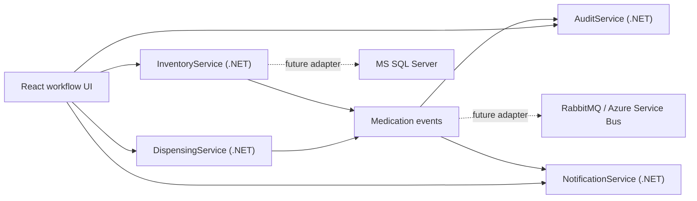

# Medication Inventory & Dispensing Platform

This is a learning-reference project for a test engineer / software engineer role that values C#, .NET, SQL Server, microservices, Playwright, REST APIs, message queues, BDD/TDD thinking, and AI-assisted engineering.

The project is intentionally readable. The first version uses in-memory adapters so you can run and understand the workflows quickly. The `infrastructure` and `docs` folders show where SQL Server, message queues, SaaS deployment, on-prem deployment, and AI-assisted testing fit.

## Architecture



## Services

| Service | Port | Responsibility |
|---|---:|---|
| InventoryService | 5101 | Medication catalog, inventory levels, restock, low-stock detection |
| DispensingService | 5102 | Dispense workflow validation and dispense records |
| AuditService | 5103 | Audit trail creation and review |
| NotificationService | 5104 | Alert and notification workflow |
| React frontend | 5173 | User workflows for inventory review and dispensing |

## Run Locally

From the repository root:

```powershell
dotnet restore MedicationPlatform.sln --configfile .\NuGet.Config
dotnet build MedicationPlatform.sln --no-restore
```

Run each service in a separate terminal:

```powershell
dotnet run --project .\backend\src\InventoryService --urls http://127.0.0.1:5101
dotnet run --project .\backend\src\DispensingService --urls http://127.0.0.1:5102
dotnet run --project .\backend\src\AuditService --urls http://127.0.0.1:5103
dotnet run --project .\backend\src\NotificationService --urls http://127.0.0.1:5104
```

Run the React app:

```powershell
cd frontend
npm.cmd install
npm.cmd run dev
```

Open `http://127.0.0.1:5173`.

## Learning Path

1. Read `docs/architecture.md` to understand the service boundaries.
2. Run `InventoryService` and call `GET /inventory`.
3. Run the React app and submit a dispense request.
4. Review `tests/bdd/dispensing.feature` and turn scenarios into automation.
5. Run the Playwright test after installing frontend dependencies.
6. Study `infrastructure/sql/schema.sql` and map the in-memory store to SQL tables.
7. Use `ai-prompts/` to practice AI-assisted test design, code review, and defect reporting.
